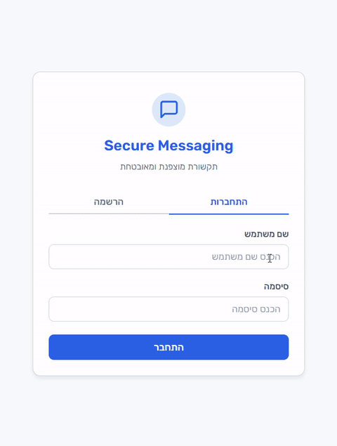
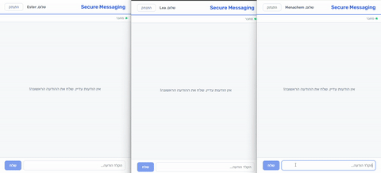
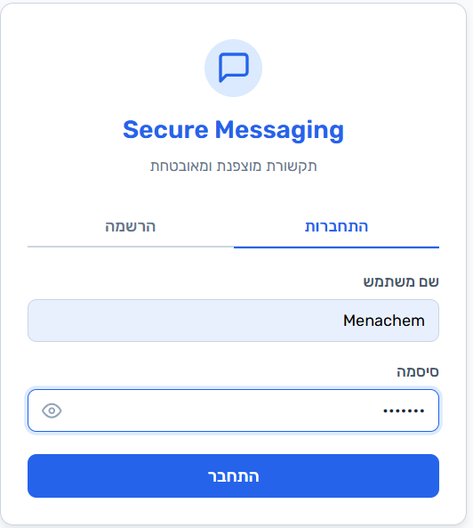
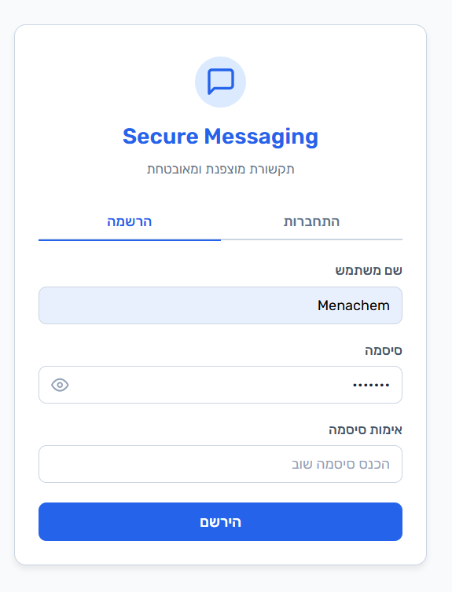
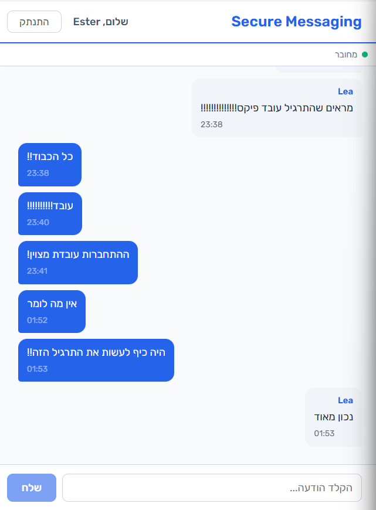
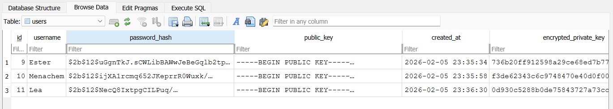
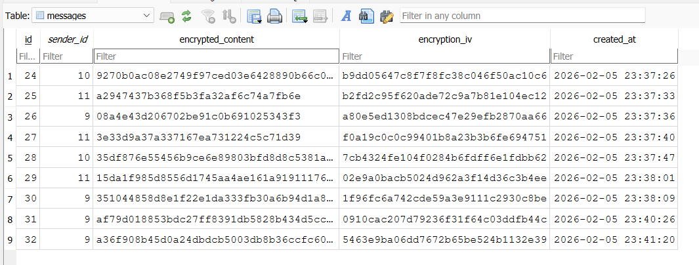
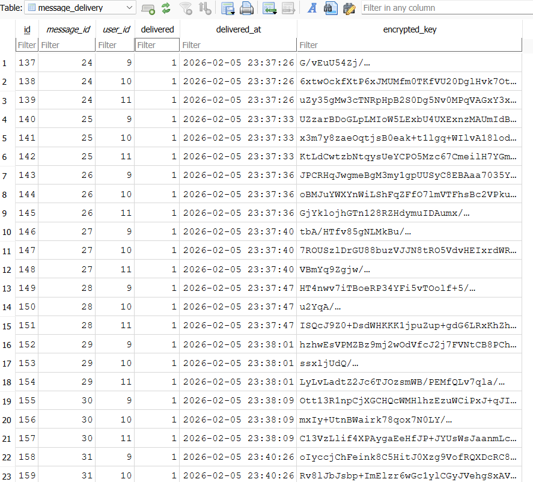

# Secure Messaging Application


**Send messages that only your recipients can read.**

A production-ready secure messaging platform featuring **true end-to-end encryption** where the server never sees your plaintext messages. Built with React 19, Node.js, and modern cryptography (RSA-2048 + AES-256-CBC).

> Hebrew RTL interface | No WebSockets required | 90 tests passing

---

## Demo

<table>
  <tr>
    <td align="center">
      <strong>Login & Registration</strong><br><br>
      
    </td>
    <td align="center">
      <strong>Real-time Encrypted Chat</strong><br><br>
      
    </td>
  </tr>
</table>

> Watch the full demo: Registration with RSA key generation, secure login, and real-time E2E encrypted messaging

---

## Screenshots

<details>
<summary><strong>Click to view application screenshots</strong></summary>

<br>

### User Interface

<table>
  <tr>
    <td align="center">
      <br>
      <em>Login Screen</em>
    </td>
    <td align="center">
      <br>
      <em>Registration with RSA Key Generation</em>
    </td>
    <td align="center">
      <br>
      <em>Real-time Encrypted Chat</em>
    </td>
  </tr>
</table>

### Database (Encrypted at Rest)

<table>
  <tr>
    <td align="center">
      <br>
      <em>Users table - hashed passwords & public keys</em>
    </td>
    <td align="center">
      <br>
      <em>Messages stored encrypted (AES-256-CBC)</em>
    </td>
    <td align="center">
      <br>
      <em>Delivery tracking with per-user encrypted keys</em>
    </td>
  </tr>
</table>

</details>

---

## Features

- **True E2E Encryption** - Server never sees plaintext messages (RSA-2048 + AES-256-CBC)
- **Real-time Messaging** - Long Polling implementation (no WebSockets required)
- **Secure Key Management** - Client-side RSA key generation with encrypted server backup
- **Production-Ready Security** - bcrypt password hashing, JWT authentication, rate limiting, Helmet headers
- **Hebrew RTL Interface** - Clean, professional design with full right-to-left support
- **90 Unit Tests** - Comprehensive coverage for auth, encryption, and messaging
- **Scalable Architecture** - Node.js clustering support, database adapter pattern

---

## Prerequisites

| Requirement | Version | Notes |
|-------------|---------|-------|
| **Node.js** | 18+ | Required for Web Crypto API compatibility |
| **npm** | 9+ | Comes with Node.js 18+ |
| **OpenSSL** | Any | For SSL certificate generation. On Windows: available via Git Bash or `choco install openssl` |
| **Modern Browser** | See below | Must support Web Crypto API |

**Supported browsers:** Chrome 37+, Firefox 34+, Edge 12+, Safari 11+

**Ports required:** `3001` (backend), `5173` (frontend) — must be available

---

## Quick Start

```bash
# Clone the repository
git clone https://github.com/estyBornstein/SecureClienServeMessagingApplicaon
cd SecureClientServerMessagingApplication

# Backend setup
cd backend
npm install
npm run generate-cert
npm run dev

# Frontend setup (new terminal)
cd frontend
npm install
npm run dev

# Open https://localhost:5173 in your browser
# Accept the self-signed certificate warning
```

**Test credentials:** `alice` / `Test@123`

---

## Architecture

```
┌─────────────────────┐                              ┌─────────────────────┐
│    React Client     │         HTTPS/TLS            │   Node.js Server    │
│                     │◄────────────────────────────►│                     │
│  ┌───────────────┐  │                              │  ┌───────────────┐  │
│  │  Web Crypto   │  │    ┌──────────────────┐      │  │    Express    │  │
│  │  RSA + AES    │  │    │  Encrypted Only! │      │  │    Routes     │  │
│  └───────────────┘  │    │  Server NEVER    │      │  └───────────────┘  │
│                     │    │  sees plaintext  │      │                     │
│  ┌───────────────┐  │    └──────────────────┘      │  ┌───────────────┐  │
│  │ Long Polling  │  │                              │  │    SQLite     │  │
│  │  (Real-time)  │  │                              │  │  (encrypted)  │  │
│  └───────────────┘  │                              │  └───────────────┘  │
└─────────────────────┘                              └─────────────────────┘
```

### How E2E Encryption Works

**Sending a message:**
1. Client generates a random AES-256 key
2. Client encrypts the message with AES-256-CBC (random IV)
3. Client encrypts the AES key with each recipient's RSA public key (RSA-OAEP/SHA-256)
4. Client sends `{ encryptedContent, iv, keys: [{ userId, encryptedKey }, ...] }` to server
5. Server stores as-is — **never decrypts**

**Receiving a message:**
1. Server returns encrypted content + the recipient's specific `encryptedKey`
2. Client decrypts the AES key with their RSA private key
3. Client decrypts the message with the recovered AES key

---

## Tech Stack

| Layer | Technology |
|-------|-----------|
| **Backend** | Node.js + Express 5 |
| **Database** | SQLite (better-sqlite3) with WAL mode |
| **Frontend** | React 19 + Vite |
| **Auth** | JWT (HS256) + bcrypt (12 rounds) |
| **E2E Encryption** | Hybrid RSA-OAEP/SHA-256 (2048-bit) + AES-256-CBC |
| **Transport** | HTTPS with self-signed certificates |
| **Real-time** | Long Polling (30s hold) |
| **Logging** | Winston with daily file rotation |
| **Testing** | Jest (50 tests) + Vitest (40 tests) |
| **Security** | Helmet, rate limiting (express-rate-limit) |
| **Scalability** | Node.js clustering support |

---

## Full Setup Guide

### 1. Generate SSL Certificates

```bash
cd backend
npm install
npm run generate-cert
```

This creates `certs/server.key` and `certs/server.cert` (self-signed, localhost).

### 2. Backend

```bash
cd backend
cp .env.example .env
npm run dev
```

HTTPS server starts on **port 3001**.

### 3. Frontend

```bash
cd frontend
cp .env.example .env
npm install
npm run dev
```

App starts on **https://localhost:5173**. Accept the self-signed certificate warning in your browser.

### 4. Seed Database

Populate with 5 test users and 15 E2E encrypted sample messages:

```bash
cd backend
npm run seed
```

**Test credentials:** `alice`, `bob`, `charlie`, `diana`, `eve` — password: `Test@123`

### 5. Run Tests

```bash
# Backend tests (50 tests)
cd backend
npm test

# Frontend tests (40 tests)
cd frontend
npm test
```

---

## API Endpoints

| Method | Endpoint | Auth | Description |
|--------|----------|------|-------------|
| POST | `/api/auth/register` | No | Register user (sends public key + encrypted private key) |
| POST | `/api/auth/login` | No | Login (returns JWT + encrypted private key backup) |
| GET | `/api/users/public-keys` | JWT | Get all users' public keys for E2E encryption |
| POST | `/api/messages/send` | JWT | Send E2E encrypted message with per-recipient keys |
| GET | `/api/messages/poll` | JWT | Long poll for new encrypted messages (30s hold) |
| GET | `/api/messages/history` | JWT | Paginated encrypted message history (`?page=1&pageSize=50`) |
| GET | `/api/health` | No | Server health check |

---

## Project Structure

```
SecureClientServerMessagingApplication/
├── certs/              - SSL certificate generation script
├── backend/
│   ├── src/
│   │   ├── config/     - JWT configuration, constants
│   │   ├── data/       - Database adapter abstraction (SQLite)
│   │   ├── middleware/ - Auth (JWT) & error handling
│   │   ├── routes/     - API routes (auth, messages, users)
│   │   ├── services/   - Business logic (auth, messaging, Long Poll)
│   │   └── utils/      - AES/RSA crypto, Winston logger
│   └── tests/          - Jest unit tests (auth, encryption, messaging)
├── frontend/
│   ├── src/
│   │   ├── components/ - React components (Auth, Chat, Common)
│   │   ├── context/    - Auth state (Context API)
│   │   ├── hooks/      - useAuth, useMessages, useLongPolling
│   │   ├── services/   - API client (Axios), message/user services
│   │   └── utils/      - Crypto (Web Crypto API + crypto-js), storage
│   └── tests/          - Vitest unit tests
└── README.md
```

---

## Security Features

| Feature | Implementation |
|---------|----------------|
| **E2E Encryption** | RSA-2048-OAEP + AES-256-CBC (server never sees plaintext) |
| **Password Hashing** | bcrypt with 12 salt rounds |
| **Authentication** | JWT (HS256) with configurable expiration |
| **Transport Security** | HTTPS/TLS encryption |
| **Rate Limiting** | 5 login/min, 3 register/min, 30 messages/min |
| **Security Headers** | Helmet middleware (CSP, X-Frame-Options, HSTS, etc.) |
| **Private Key Protection** | PBKDF2 (100K iterations) + AES-256-CBC backup on server |

---

## Real-time: Long Polling (No WebSockets)

Per project requirements, WebSockets are not used. Instead, Long Polling is implemented:

1. Client sends `GET /api/messages/poll` with JWT
2. Server checks for undelivered encrypted messages
3. If messages exist — responds immediately with encrypted data + per-user key
4. If no messages — holds the connection for 30 seconds
5. When a new message arrives — server immediately responds to all waiting clients
6. On timeout — responds with empty array
7. Client immediately starts a new poll request

**In-memory client map** (`Map<userId, { res, timeout }>`) tracks waiting connections.

---

## Trade-offs & Limitations

| Area | Trade-off |
|------|-----------|
| **Long Polling vs SSE** | Higher latency and bandwidth than SSE, but simpler and more compatible |
| **True E2E** | New users cannot read messages sent before their registration |
| **Private key in localStorage** | Persists between sessions for convenience; less secure than hardware key store |
| **RSA per recipient** | O(n) key encryptions per message — suitable for <100 users |
| **SQLite** | Not suitable for heavy concurrent writes; sufficient for development |
| **In-memory poll map** | Lost on server restart; not horizontally scalable without Redis |
| **Self-signed certs** | Browser warnings in development; use CA-signed certs in production |

---

## Scalability

**Clustering support:** Enable multi-core utilization by setting `ENABLE_CLUSTER=true` in `.env`.

```bash
# Enable clustering for production
ENABLE_CLUSTER=true
CLUSTER_WORKERS=4  # or leave empty for auto-detect (number of CPU cores)
```

---


## Production Recommendations

- [x] **Rate limiting**: Implemented on auth and message endpoints
- [x] **Security headers**: Helmet middleware enabled
- [x] **Clustering**: Node.js cluster module support added
- [ ] **Database**: Migrate to PostgreSQL (use adapter pattern — one file change)
- [ ] **Scaling**: Add Redis Pub/Sub for multi-server Long Polling
- [ ] **TLS**: Replace self-signed certificates with CA-signed ones
- [ ] **Token blacklist**: Implement JWT revocation (Redis-backed)
- [ ] **2FA**: Add two-factor authentication
- [ ] **Key rotation**: Implement periodic RSA key pair rotation
- [ ] **Monitoring**: Add health metrics and alerting
- [ ] **Security audit**: Run OWASP dependency check

---

## Environment Variables

### Backend (`.env`)

| Variable | Default | Description |
|----------|---------|-------------|
| `PORT` | `3001` | Server port |
| `JWT_SECRET` | — | JWT signing secret (change in production!) |
| `JWT_EXPIRATION` | `24h` | Token lifetime |
| `DATABASE_PATH` | `./data/messaging.db` | SQLite file path |
| `DB_TYPE` | `sqlite` | Database type |
| `LOG_LEVEL` | `info` | Winston log level |
| `CLIENT_URL` | `https://localhost:5173` | CORS allowed origin |
| `ENABLE_CLUSTER` | `false` | Enable Node.js clustering |
| `CLUSTER_WORKERS` | (CPU cores) | Number of worker processes |

### Frontend (`.env`)

| Variable | Default | Description |
|----------|---------|-------------|
| `VITE_API_URL` | `https://localhost:3001/api` | Backend API base URL |
| `VITE_POLL_TIMEOUT` | `30000` | Poll timeout (ms) |

---

## Testing

### Backend Tests (Jest)

```bash
cd backend
npm test
```

**50 tests** across 4 suites:
- `auth.test.js` - User registration, login, JWT validation
- `encryption.test.js` - RSA/AES encryption, key generation
- `messaging.test.js` - Message creation, delivery, broadcasting
- `integration.test.js` - Full API endpoint tests

### Frontend Tests (Vitest)

```bash
cd frontend
npm test
```

**40 tests** covering:
- `crypto.test.js` - AES encryption, private key protection
- `storage.test.js` - localStorage operations
- `LoginForm.test.jsx`, `RegisterForm.test.jsx` - Auth components
- `ChatPage.test.jsx` - Message rendering
- `useLongPolling.test.js` - Polling connection logic

---

## Troubleshooting

| Problem | Solution |
|---------|----------|
| **"Your connection is not private"** (Chrome) / **SSL cert warning** | Expected with self-signed certs. Click **Advanced** > **Proceed to localhost** in Chrome, or **Accept the Risk** in Firefox |
| **`ERR_SSL_PROTOCOL_ERROR`** | Make sure you're using `https://` not `http://`. Both client and server require HTTPS |
| **CORS errors in browser console** | Verify `CLIENT_URL` in backend `.env` matches your frontend URL exactly (including port) |
| **"Cannot connect to server"** | Check backend is running on port 3001. Run `npm run dev` in the `backend/` directory |
| **Messages show "[Unable to decrypt]"** | Private key mismatch. Clear localStorage and re-register: run `localStorage.clear()` in browser console, then create a new account |
| **Certificate generation failed** | Ensure OpenSSL is installed. On Windows: install via Git Bash or `choco install openssl` |
| **Database locked errors** | Stop all running server instances. Only one process can write to SQLite at a time |
| **Seed script fails** | Delete `backend/data/messaging.db` and run `npm run seed` again |
| **Long Polling not receiving messages** | Check browser DevTools **Network** tab for a pending `/api/messages/poll` request. If missing, refresh the page |
| **Login works but chat is empty** | Run `npm run seed` to populate test messages, or send a new message from another logged-in user |
| **Port already in use** | Kill the process: `npx kill-port 3001` or `npx kill-port 5173` |
| **Tests failing** | Run `npm install` in both `backend/` and `frontend/`. Ensure no server is running during tests |

---

## License

MIT License - See [LICENSE](LICENSE) file for details.

---

## Contributing

Contributions are welcome! Please feel free to submit a Pull Request.

1. Fork the repository
2. Create your feature branch (`git checkout -b feature/amazing-feature`)
3. Commit your changes (`git commit -m 'Add amazing feature'`)
4. Push to the branch (`git push origin feature/amazing-feature`)
5. Open a Pull Request

---

**Built with security in mind.**
